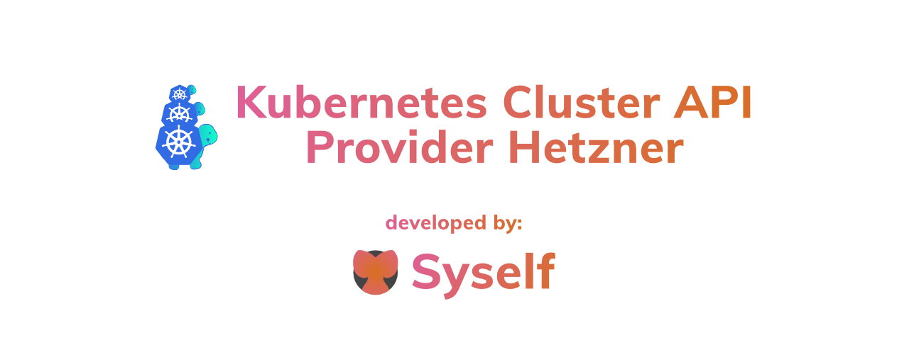

<h1 align="center"></h1>

<h4 align="center">
    <a href="docs/topics/quickstart.md">Guide</a> |
    <a href="docs/README.md">Docs Index</a> |
    <a href="docs/developers/development.md">Development Docs</a>  
    <a href="https://cluster-api.sigs.k8s.io/">Cluster API Book</a>  
</h4>

---

    
    
    
    
    
    

The Kubernetes Cluster API Provider Hetzner enables declarative provisioning of multiple Kubernetes clusters on [Hetzner infrastructure](https://hetzner.cloud).
High-available Kubernetes clusters on bare metal and on cloud instances are supported. The Cluster API simplifies the creation, updates, and operation of production-ready clusters. Self-managed Kubernetes clusters can, therefore, be easily operated even at a large scale.

> Disclaimer: This is no official Hetzner project! It is maintained by the folks of the cloud-native start-up Syself.
> If you have questions or are interested in running production-ready Kubernetes clusters on Hetzner, then please contact us via e-mail: [info@syself.com](mailto:info@syself.com?subject=cluster-api-provider-hetzner).

## :newspaper: What is the Cluster API Provider Hetzner?
The [Cluster API][cluster_api] orchestrates infrastructure similar to the way Kubernetes manages containers. It implements a declarative API like Kubernetes does and extends the resources of the Kubernetes API server via CRDs.
The Cluster API consist of the CAPI controller, the control-plane provider, the bootstrap provider, and a provider integration that implements the necessary controllers to enable stable and highly available Kubernetes clusters on the infrastructure of a certain cloud provider.
The controllers ensure that the desired state of the infrastructure is achieved - just as Kubernetes ensures the desired state of containers. This concept is called Infrastructure as Software and has significant advantages over Infrastructure as Code (IaC) solutions because it can react automatically to changes and problems. The best example of this is the MachineHealthCheck, which replaces unhealthy nodes automatically.

Using the Hetzner Provider unites the benefits of declarative infrastructure, cost-effectiveness, and (GDPR-compliant) European cloud.

## :sparkles: Features

* Native Kubernetes manifests and API
* Choice of Linux distribution
* Support for single and multi-node control plane clusters (HA Kubernetes)
* Support for Hetzner Cloud placement groups, network and load balancer
* Complete day 2 operations - updating Kubernetes and nodes, scaling up and down, self-healing
* Custom CSR approver for approving [kubelet-serving certificate signing requests](https://kubernetes.io/docs/tasks/administer-cluster/kubeadm/kubeadm-certs/#kubelet-serving-certs)
* Hetzner dedicated servers / bare metal

## :rocket: Get Started
If you're looking to jump straight into it, go ahead:

* [**Cluster API Provider Hetzner 15 Minute Tutorial**](docs/topics/quickstart.md): Set up a bootstrap cluster using Kind and deploy a Kubernetes cluster on Hetzner
* [**Develop and test Kubernetes clusters with Tilt**](docs/developers/development.md): Start using Tilt for rapid testing of various cluster flavors, like with/without a private network or bare metal.
* [**Develop and test own node-images**](docs/topics/node-image.md): How to use your own machine images for production systems.

In addition to the pure creation and operation of Kubernetes clusters, this provider can also validate and approve certificate signing requests. This increases security as the kubelets of the nodes can be operated with signed certificates. This enables the metrics-server to run securely. [Click here](docs/topics/advanced-caph.md#csr-controller) to read more about the CSR controller.
## :fire: Compatibility with Cluster API and Kubernetes Versions

This provider's versions are compatible with the following versions of Cluster API:

|  | Cluster API `v1beta1` (`v1.0.x`) | Cluster API `v1beta1` (`v1.1.x`)  | Cluster API `v1beta1` (`v1.2.x`) |
|---|---|---|
|Hetzner Provider `v1.0.x` | ✓ | ✓ | ✓ |

This provider's versions can install and manage the following versions of Kubernetes:

|  | Hetzner Provider `v1.0.x` |
|---|---|
| Kubernetes 1.22.x | ✓ |
| Kubernetes 1.23.x | ✓ |
| Kubernetes 1.24.x | ✓ |

Test status:

* `✓` tested
* `+` should work, but we weren't able to test it

Each version of Cluster API for Hetzner will attempt to support at least two Kubernetes versions. 

**NOTE:** As the versioning for this project is tied to the versioning of Cluster API, future modifications to this policy may be made to more closely align with other providers in the Cluster API ecosystem.

---

## :white_square_button: Operating System Images
**Note**: Cluster API Provider Hetzner relies on a few prerequisites, which have to be already installed in the used operating system images, e.g. a container runtime, kubelet, and Kubeadm. Reference images can be found in kubernetes-sigs/image-builder and [templates/node-image](templates/node-image). If it isn't possible to pre-install these prerequisites in the image, you can always deploy and execute some custom scripts through the Kubeadm config. [Read more...](docs/topics/node-image.md)

---
## :book: Documentation

Docs can be found in the `/docs` directory. [Here](docs/README.md) you can find an overview of our documentation.

## :busts_in_silhouette: Getting Involved and Contributing

Are you interested in contributing to Cluster API Provider Hetzner? We, the
maintainers and community, would love your suggestions, contributions, and help!
If you want to learn more about how to get involved, you can contact the maintainers at any time.

To set up your environment, try out the development guide.

In the interest of getting more new people involved, we tag issues with
[`good first issue`][good_first_issue].
These are typically issues that have a smaller scope, but are good to get acquainted with the codebase.

We also encourage ALL active community participants to act as if they are
maintainers, even if you don't have "official" write permissions. This is a
community effort, we are here to serve the Kubernetes community. If you have an
active interest and you want to get involved, you have real power! Don't assume
that the only people who can get things done around here are the "maintainers".

We would also love to add more "official" maintainers, so show us what you can
do!

## :dizzy: Code of Conduct

Participation in the Kubernetes community is governed by the [Kubernetes Code of Conduct](code-of-conduct.md).

## :shipit: Github Issues

### :bug: Bugs

If you think you have found a bug, please follow these steps:

- Take some time to give due diligence to the issue tracker. Your issue might be a duplicate.
- Get the logs from the cluster controllers. Paste this into your issue.
- Open a [bug report][bug_report].
- Give it a meaningful title to help others who might be searching for your issue in the future.
- If you have questions, reach out to the Cluster API community on the [Kubernetes Slack channel][slack_info].

### :star: Tracking New Features

We also use the issue tracker to track features. If you have an idea for a feature or think that you can help Cluster API Provider Hetzner become even more awesome, then follow these steps:

- Open a [feature request][feature_request].
- Give it a meaningful title to help others who might be searching for your issue in the future.
- Define clearly the use case. Use concrete examples, e.g. "I type `this` and
  Cluster API Provider Hetzner does `that`".
- Some of our larger features will require some design. If you would like to
  include a technical design for your feature, please include it in the issue.
- After the new feature is well understood and the design is agreed upon, we can
  start coding the feature. We would love if you code it. So please open
  up a **WIP** *(work in progress)* pull request. Happy coding!

<!-- References -->

[good_first_issue]: https://github.com/syself/cluster-api-provider-hetzner/issues?q=is%3Aissue+is%3Aopen+sort%3Aupdated-desc+label%3A%22good+first+issue%22
[bug_report]: https://github.com/syself/cluster-api-provider-hetzner/issues/new?template=bug_report.md
[feature_request]: https://github.com/syself/cluster-api-provider-hetzner/issues/new?template=feature_request.md
[slack_info]: https://github.com/kubernetes/community/tree/master/communication#slack
[cluster_api]: https://github.com/kubernetes-sigs/cluster-api
[quickstart]: https://cluster-api.sigs.k8s.io/user/quick-start.html