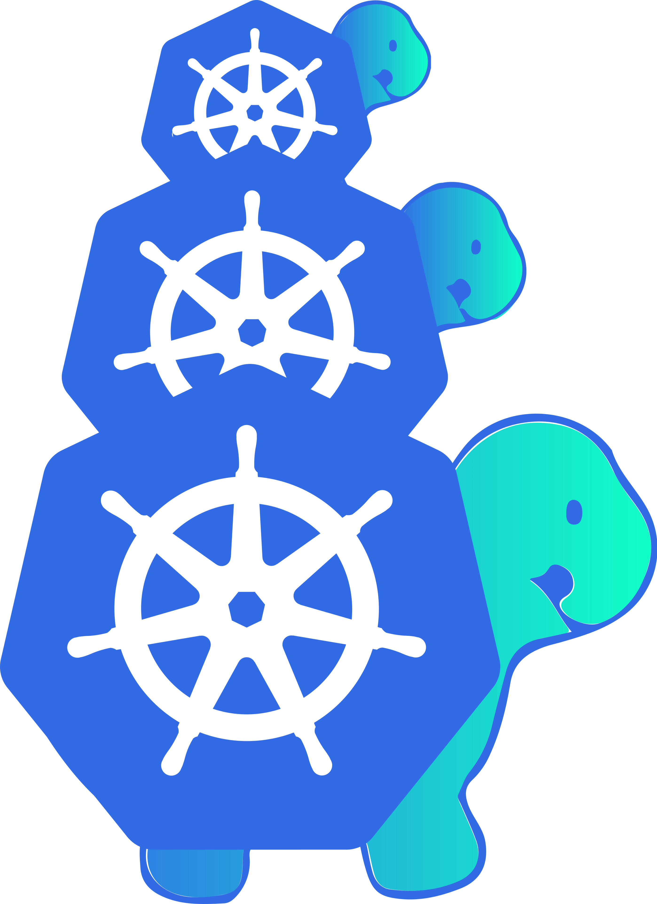
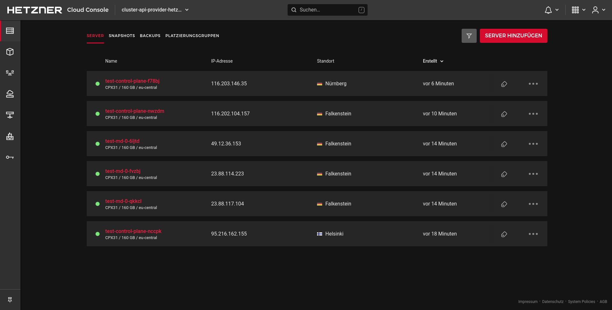

#  Kubernetes Cluster API Provider Hetzner

Kubernetes-native declarative infrastructure for [Hetzner](https://hetzner.cloud).

## What is the Cluster API Provider Hetzner

The [Cluster API][cluster_api] brings declarative, Kubernetes-style APIs to cluster creation, configuration and management.
By using the Cluster API, it is very easy to build highly available Kubernetes clusters on Hetzner servers. The Hetzner provider is the most cost-effective of all currently supported providers.

> Disclaimer: This is no official Hetzner Project! It's maintained by the folks of the cloud-native startup Syself.
> If you have questions or are interested in running production-ready Kubernetes clusters on Hetzner, then please contact us via mail: [info@syself.com](mailto:info@syself.com?subject=cluster-api-provider-hetzner)

## Launching a Kubernetes cluster on Hetzner

Check out the [**Quickstart Guide**](docs/topics/quickstart.md) to create your first Kubernetes cluster on Hetzner using Cluster API.

## Features

* Native Kubernetes manifests and API
* Choice of Linux distribution (as long as a current cloud-init is available)
* Support for single and multi-node control plane clusters (HA Kubernetes)
* Support for Hetzner Cloud Placement groups, Network and Loadbalancer
* Complete day 2 operations - updating Kubernetes and nodes, scale up and down, self-healing
* Custom CSR-approver for approving [kubelet-serving certificate signing requests](https://kubernetes.io/docs/tasks/administer-cluster/kubeadm/kubeadm-certs/#kubelet-serving-certs)
* Hetzner Dedicated Server *coming soon*

---

## Compatibility with Cluster API and Kubernetes Versions

This provider's versions are compatible with the following versions of Cluster API:

|  | Cluster API `v1beta1` (`v1.0.x`) | Cluster API `v1beta1` (`v1.1.x`) |
|---|---|---|
|Hetzner Provider `v1.0.x` | ✓ | ✓ |

This provider's versions can install and manage the following versions of Kubernetes:

|  | Hetzner Provider `v1.0.x` |
|---|---|
| Kubernetes 1.22.x | ✓ |
| Kubernetes 1.23.x | ✓ |

Test status:

* `✓` tested
* `+` should work, but we weren't able to test it

Each version of Cluster API for Hetzner will attempt to support at least two Kubernetes versions 

**NOTE:** As the versioning for this project is tied to the versioning of Cluster API, future modifications to this policy may be made to more closely align with other providers in the Cluster API ecosystem.

------

## Operating system images
**Note**: Cluster API Provider Hetzner relies on a few prerequisites which have to be already installed in the used operating system images, e.g. a container runtime, kubelet, kubeadm... . Reference images can be found in kubernetes-sigs/image-builder and in [templates/node-image](templates/node-image). If it isn't possible to pre-install those prerequisites in the image, you can always deploy and execute some custom scripts through the KubeadmConfig.

---
## Documentation

Docs can be found in the `/docs` directory. Index could be found [here](docs/README.md).

## Getting involved and contributing

Are you interested in contributing to cluster-api-provider-hetzner? We, the
maintainers and community, would love your suggestions, contributions, and help!
Also, the maintainers can be contacted at any time to learn more about how to get
involved.

To set up your environment try out the development guide.

In the interest of getting more new people involved, we tag issues with
[`good first issue`][good_first_issue].
These are typically issues that have a smaller scope but are good ways to start
to get acquainted with the codebase.

We also encourage ALL active community participants to act as if they are
maintainers, even if you don't have "official" write permissions. This is a
community effort, we are here to serve the Kubernetes community. If you have an
active interest and you want to get involved, you have real power! Don't assume
that the only people who can get things done around here are the "maintainers".

We also would love to add more "official" maintainers, so show us what you can
do!

## Code of conduct

Participation in the Kubernetes community is governed by the [Kubernetes Code of Conduct](code-of-conduct.md).

## Github issues

### Bugs

If you think you have found a bug please follow the instructions below.

- Please spend a small amount of time giving due diligence to the issue tracker. Your issue might be a duplicate.
- Get the logs from the cluster controllers. Please paste this into your issue.
- Open a [bug report][bug_report].
- Remember users might be searching for your issue in the future, so please give it a meaningful title to helps others.
- Feel free to reach out to the cluster-api community on [kubernetes slack][slack_info].

### Tracking new features

We also use the issue tracker to track features. If you have an idea for a feature, or think you can help Cluster API Provider Hetzner become even more awesome, then follow the steps below.

- Open a [feature request][feature_request].
- Remember users might be searching for your issue in the future, so please
  give it a meaningful title to helps others.
- Clearly define the use case, using concrete examples. EG: I type `this` and
  cluster-api-provider-hetzner does `that`.
- Some of our larger features will require some design. If you would like to
  include a technical design for your feature please include it in the issue.
- After the new feature is well understood, and the design agreed upon we can
  start coding the feature. We would love for you to code it. So please open
  up a **WIP** *(work in progress)* pull request, and happy coding.

<!-- References -->

[good_first_issue]: https://github.com/syself/cluster-api-provider-hetzner/issues?q=is%3Aissue+is%3Aopen+sort%3Aupdated-desc+label%3A%22good+first+issue%22
[bug_report]: https://github.com/syself/cluster-api-provider-hetzner/issues/new?template=bug_report.md
[feature_request]: https://github.com/syself/cluster-api-provider-hetzner/issues/new?template=feature_request.md
[slack_info]: https://github.com/kubernetes/community/tree/master/communication#slack
[cluster_api]: https://github.com/kubernetes-sigs/cluster-api
[quickstart]: https://cluster-api.sigs.k8s.io/user/quick-start.html