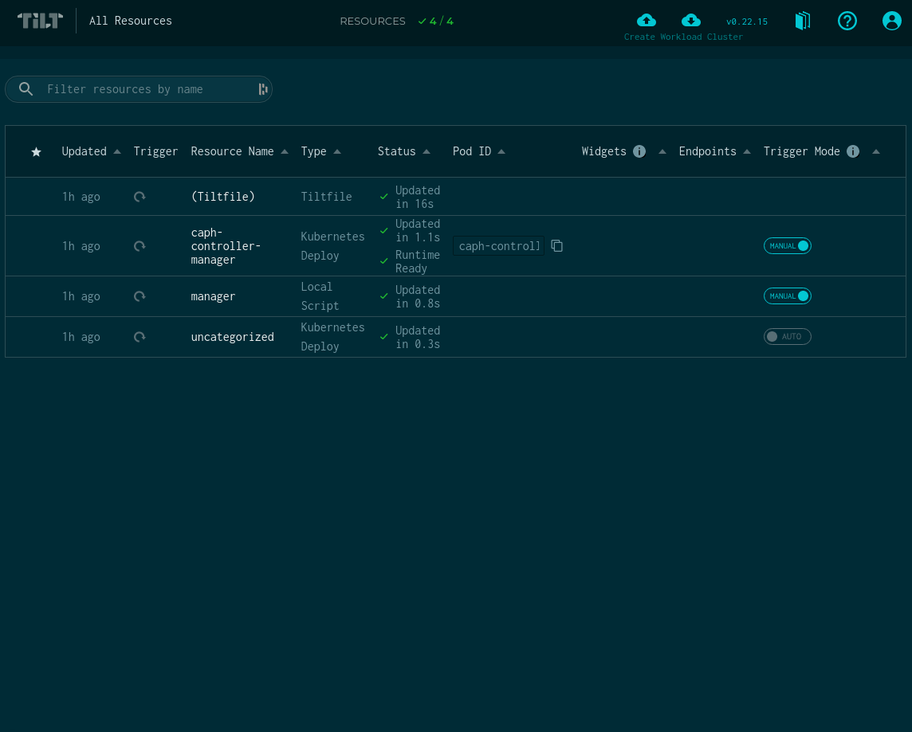

# Developing Cluster API Provider Hetzner

## Setting up

### Base requirements

1. Install Go
   - Get the latest patch version for go v1.17.
2. Install Kind
3. Install Kustomize
4. Install make
5. Install clusterctl
6. Install ctlptl
7. Install Helm
8. Install Kubectl
9. Install [timeout](http://man7.org/linux/man-pages/man1/timeout.1.html)
### Get the source

Clone or Fork this repo

### Get familiar with basic concepts

This provider is modeled after the upstream Cluster API project. To get familiar
with Cluster API resources, concepts and conventions ([such as CAPI and CAPH](https://cluster-api.sigs.k8s.io/reference/glossary.html#c)), refer to the [Cluster API Book](https://cluster-api.sigs.k8s.io/).

### Dev manifest files

Part of running cluster-api-provider-hetzner is generating manifests to run.
Generating dev manifests allows you to test dev images instead of the default
releases.

### Dev images

#### Container registry

Any public container registry can be leveraged for storing cluster-api-provider-hetzner container images.

## CAPH Node images

In order to deploy a workload cluster you will need to build the node images to use, for that you can reference the [image-builder](https://github.com/kubernetes-sigs/image-builder)
project, also you can read the [image-builder book](https://image-builder.sigs.k8s.io/)

Please refer to the image-builder documentation in order to get the latest requirements to build the node images.

In HCloud the following ways are available:
1. Using an Image from Hetzner and installing required Software via cloud-init (pre-kubeadm/post-kubeadm) commands. You only need to set the right image-name under spec.template.spec.imageName in the HCloudMachineTemplate.
2. Building a custom image and snapshotting it. For example via packer. Here it's important that a snapshot label is created with the key: "caph-image-name". The value needs also to be set under spec.template.spec.imageName in the HCloudMachineTemplate.

To develop/build an image with packer do:

```shell
export HCLOUD_TOKEN=<your-token>

## Only build
packer build templates/node-image/1.23.4-fedora-35-crio/image.json

## Debug and ability to ssh into the created server
packer build --debug --on-error=abort templates/node-image/1.23.4-fedora-35-crio/image.json
```

It's recommended to use cx21 server type as this is more powerful than cx11 and Kubernetes usual doesn't run well on only 1vCpu. Using this server type will use 40GB of SSD. This means that we cannot boot machines from this snapshot with a disk with less than 40GB.

To see the available images in hetzner:
```shell
hcloud image list
```

## Developing

### Modules and Dependencies

This repository uses [Go Modules](https://github.com/golang/go/wiki/Modules) to track vendor dependencies.

To pin a new dependecy:

- Run `go get <repository>@<version>`
- (Optional) Add a replace statement in `go.mod`

Makefile targets and scripts are offered to work with go modules:

- `make modules` runs `go mod tidy` to ensure proper vendoring.
- `make check-go` checks that the Go version and environment variables are properly set.

### Setting up the environment

* Create a new Hetzner project. For each cluster it is recommended to have a seperate project in the Hetzner cloud.
* Create a Hetzner API-TOKEN with read & write permissions.
* Generate a ssh-key (`ssh-keygen -t ed25519 -C "your_email@example.com" -f ~/.ssh/cluster
`) and upload the public key in the project. Give it a useful name as you need to specify the ssh name in the cluster-template ($HCLOUD_SSH_KEY).


### Tilt Requirements

To verify if the installed versions meets the requirements and additionally install them (mac & linux): `make install-dev-prerequisites`

This ensures the following:
- clusterctl
- ctlptl
- go
- helm
- helmfile
- kind
- kubectl
- packer
- tilt
- hcloud

Some of them like helmfile or packer are not needed for developing the controller, but very helpful if you are developing images or stuff for production use.
Other needed binaries as kubebuilder are downloaded on-demand via the go-get-tool in the makefile.

### Using Tilt

<p align="center">

</p> 

Provider Integration development requires a lot of iteration, and the “build, tag, push, update deployment” workflow can be very tedious. Tilt makes this process much simpler by watching for updates, then automatically building and deploying them.

Both of the [Tilt](https://tilt.dev) setups below will get you started developing CAPH in a local kind cluster. The main difference is the number of components you will build from source and the scope of the changes you'd like to make. If you only want to make changes in CAPH, then follow [Tilt in CAPH](#tilt-for-dev-in-CAPH).

This will save you from having to build all of the images for CAPI, which can take a while. If the scope of your development will span both CAPH and CAPI, then follow the [Tilt in CAPH and CAPI](#tilt-for-dev-in-both-CAPH-and-CAPI).

#### Tilt for dev in CAPH

If you want to develop in CAPH and get a local development cluster working quickly, this is the path for you.
Of course, there is also a legacy way to 

>HCLOUD_TOKEN and HCLOUD_SSH_KEY are mandadory to set. 

Run the following to generate your minimal `tilt-settings.json` file:

```shell
cat <<EOF > tilt-settings.json
{
  "kustomize_substitutions": {
    "HCLOUD_TOKEN": "<YOUR-TOKEN>",
    "HCLOUD_SSH_KEY": "test"
  }
}
EOF
```

If you want to set own values (for a full list please have a look into the Tiltfile)
Also visit the [documentation here](tilt.md)

##### Start Tilt

To build a kind cluster and start Tilt, now just run:

```shell
make tilt-up
```
> To access the Tilt UI please go to: `http://localhost:10350`


By default, the Cluster API components deployed by Tilt have experimental features turned off.
If you would like to enable these features, add `extra_args` as specified in [The Cluster API Book](https://cluster-api.sigs.k8s.io/developer/tilt.html#create-a-tilt-settingsjson-file).

Once your kind management cluster is up and running, you can deploy a workload cluster.
This could be done trough the tilt UI, by pressing the button in the top right corner "Create Workload Cluster". This triggers the `make create-workload-cluster` which uses the environment variables (we defined in the tilt-settings.json) and the cluster-template. It also install cilium as CNI. If you want to use the make command manually please ensure to export first the [environment variables](#Deploying-a-workload-cluster).

---- 
To tear down the workload cluster press the "Delete Workload Cluster" button. After a few minutes the resources should be deleted. 

Of course you could skip the step and delete the managment cluster directly. But then you need to clean-up resources manually in the "hHtzner Cloud Console".

To tear down the kind cluster just run:

```shell
$ make delete-cluster
```
To delete also the registry use: `make delete-registry` or `make delete-cluster-registry`


#### Tilt for dev in both CAPH and CAPI

If you want to develop in both CAPI and CAPH at the same time, then this is the path for you.

To use [Tilt](https://tilt.dev/) for a simplified development workflow, follow the [instructions](https://cluster-api.sigs.k8s.io/developer/tilt.html) in the cluster-api repo.  The instructions will walk you through cloning the Cluster API (CAPI) repository and configuring Tilt to use `kind` to deploy the cluster api management components.

> you may wish to checkout out the correct version of CAPI to match the [version used in CAPH][go.mod]

Note that `tilt up` will be run from the `cluster-api repository` directory and the `tilt-settings.json` file will point back to the `cluster-api-provider-hetzner` repository directory.  Any changes you make to the source code in `cluster-api` or `cluster-api-provider-hetzner` repositories will automatically redeployed to the `kind` cluster.

After you have cloned both repositories, your folder structure should look like:

```tree
|-- src/cluster-api-provider-hetzner
|-- src/cluster-api (run `tilt up` here)
```

Now you need to configure the environment variables, alternatively add them to the kustomize_substitutions.


Run the following to generate your `tilt-settings.json` file:

```shell
cat <<EOF > tilt-settings.json
{
  "default_registry": "${REGISTRY}",
  "provider_repos": ["../cluster-api-provider-hetzner"],
  "enable_providers": ["caph-controller-manager", "kubeadm-bootstrap", "kubeadm-control-plane"],
  "kustomize_substitutions": {
    "HCLOUD_SSH_KEY": "test",
    "HCLOUD_REGION": "fsn1",
    "CONTROL_PLANE_MACHINE_COUNT": "3",
    "WORKER_MACHINE_COUNT": "3",
    "KUBERNETES_VERSION": "v1.21.1",
    "HCLOUD_IMAGE_NAME": "test",
    "HCLOUD_CONTROL_PLANE_MACHINE_TYPE": "cpx31",
    "HCLOUD_WORKER_MACHINE_TYPE": "cpx31",
    "CLUSTER_NAME": "test"
  }
}
EOF
```

> `$REGISTRY` should be in the format `docker.io/<dockerhub-username>`

The cluster-api management components that are deployed are configured at the `/config` folder of each repository respectively. Making changes to those files will trigger a redeploy of the management cluster components.

##### Creating the secret for the hetzner provider:

```shell
kubectl create secret generic hetzner --from-literal=hcloud=$HCLOUD_TOKEN
```
### Deploying a workload cluster without Tilt

If you want to deploy a workload cluster with the common way without letting tilt doing this for you.
You need first to set some environment variables.

```shell
export HCLOUD_TOKEN="<YOUR-TOKEN>" \
export HCLOUD_REGION="fsn1" \
export HCLOUD_SSH_KEY="test" \
export CONTROL_PLANE_MACHINE_COUNT=1 \
export WORKER_MACHINE_COUNT=1 \
export KUBERNETES_VERSION=1.21.1 \
export HCLOUD_IMAGE_NAME=<IMAGE-PATH> \
export HCLOUD_CONTROL_PLANE_MACHINE_TYPE=cpx31 \
export HCLOUD_WORKER_MACHINE_TYPE=cpx31 \
export CLUSTER_NAME="test" 
```

#### Creating the secret for the hetzner provider:

```shell
kubectl create secret generic hetzner --from-literal=hcloud=$HCLOUD_TOKEN
```

#### Creating the "Workload Cluster":
```shell
$ make create-workload-cluster
```

#### To delete the "Workload Cluster":
```shell
$ make delete-workload-cluster
```

### Submitting PRs and testing

Pull requests and issues are highly encouraged!
For more information please have a look in the [Contribution Guidelines](../../CONTRIBUTING.md)
If you're interested in submitting PRs to the project, please be sure to run some initial checks prior to submission:

```shell
$ make go-lint # Runs a suite of quick scripts to check code structure
$ make test # Runs tests on the Go code
```

#### Executing unit tests

`make test` executes the project's unit tests. These tests do not stand up a
Kubernetes cluster, nor do they have external dependencies.

### Running local e2e test

```
export HCLOUD_TOKEN=<your-hcloud-token>
make test-e2e
```

These commands will build the manager-image locally and will create automatically a SSH Key in Hcloud. Then it will start the e2e test suite with Ginkgo.